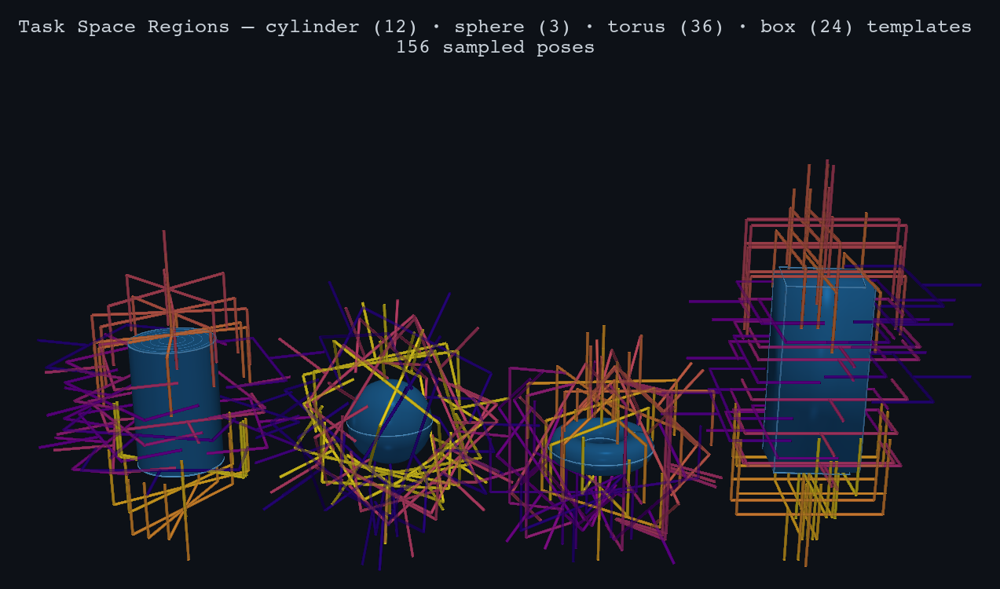
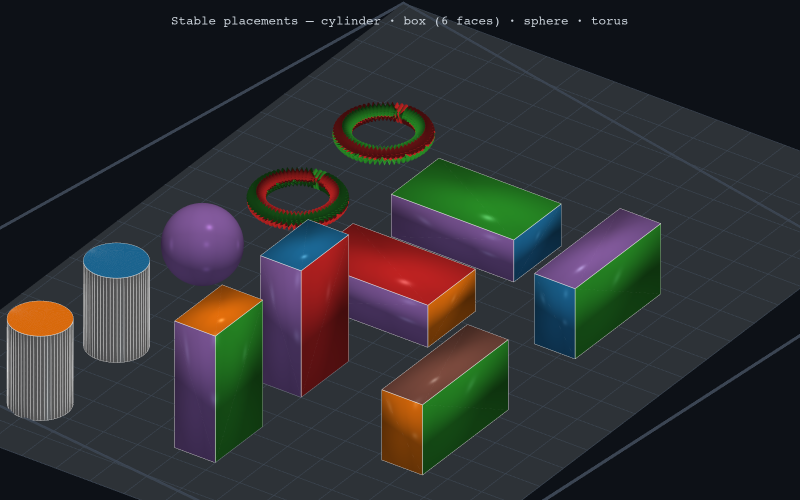
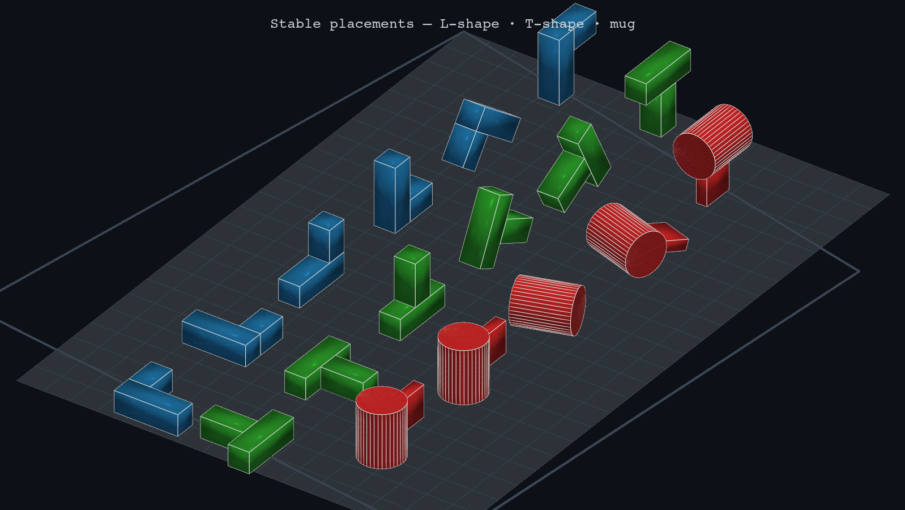

# Task Space Regions (TSR)

A Python library for pose-constrained manipulation planning using Task Space Regions.

TSRs encode *any* manipulation constraint as a bounded region in SE(3): grasping,
placing, transporting, pouring, tool use, and more. A planner samples from a TSR
to get valid end-effector poses satisfying the constraint.

Based on the IJRR paper ["Task Space Regions: A Framework for Pose-Constrained Manipulation Planning"](https://www.ri.cmu.edu/pub_files/2011/10/dmitry_ijrr10-1.pdf) by Berenson, Srinivasa, and Kuffner.

## Gallery

### Grasps



### Stable placements



*Cylinder, box, sphere, and torus in every stable pose on a table surface.*



*L-shape, T-shape, and a mug (cylinder + handle) — `place_mesh` applied to arbitrary vertex clouds. Each object is shown in all stable orientations above the 5° margin threshold.*

## Installation

```bash
uv add git+https://github.com/personalrobotics/tsr.git
```

For visualization support:
```bash
uv add "tsr[viz] @ git+https://github.com/personalrobotics/tsr.git"
```

For development:
```bash
git clone https://github.com/personalrobotics/tsr.git
cd tsr
uv sync --extra test
```

## Quick Start

### Load templates for a full manipulation task

Templates are YAML files that encode pose constraints for each step of a task.
The library ships with two narratives:

```python
from tsr import load_package_template
import numpy as np

# --- Tool use: screwdriver ---
grasp = load_package_template("grasps", "screwdriver_grasp.yaml")
drive = load_package_template("tasks",  "drive_screw.yaml")
drop  = load_package_template("places", "toolchest_drop.yaml")

screwdriver_pose = np.eye(4)
screwdriver_pose[:3, 3] = [0.4, 0.1, 0.02]

gripper_poses = grasp.instantiate(screwdriver_pose).sample()

# --- Everyday manipulation: mug of water ---
pick      = load_package_template("grasps", "mug_handle_grasp.yaml")
carry     = load_package_template("tasks",  "mug_transport_upright.yaml")
pour      = load_package_template("tasks",  "mug_pour_into_sink.yaml")
place     = load_package_template("places", "mug_on_table.yaml")
```

### Generate templates from object geometry

#### Grasping

`ParallelJawGripper` generates TSR templates directly from shape parameters:

```python
import numpy as np
from tsr.hands import ParallelJawGripper

gripper = ParallelJawGripper(finger_length=0.055, max_aperture=0.140)

# Cylinder — side + top + bottom: 4*k templates (default k=3: 12 total)
templates = gripper.grasp_cylinder(
    cylinder_radius=0.040,   # 4 cm radius
    cylinder_height=0.120,   # 12 cm tall
    reference="mug",
)

# Box — all six faces, two finger orientations per face: up to 2*6*k templates
templates = gripper.grasp_box(box_x=0.08, box_y=0.06, box_z=0.18, reference="box")

# Sphere — full SO(3) approach: k templates
templates = gripper.grasp_sphere(object_radius=0.040, reference="ball")

# Torus — side (all minor angles) + span (if aperture allows)
templates = gripper.grasp_torus(
    torus_radius=0.035,   # major radius R: center to tube center
    tube_radius=0.015,    # minor radius r: tube cross-section
    reference="handle",
)

# Instantiate at a specific object pose and sample
mug_pose = np.eye(4)
mug_pose[:3, 3] = [0.5, 0.0, 0.0]   # mug at x=0.5m

grasp_poses = [t.instantiate(mug_pose).sample() for t in templates]
```

#### Placing

`TablePlacer` generates one TSR template per stable resting pose on a flat surface:

```python
import numpy as np
from tsr.placement import TablePlacer

placer = TablePlacer(table_x=0.60, table_y=0.40)

# Analytic primitives
templates = placer.place_cylinder(cylinder_radius=0.040, cylinder_height=0.120, subject="mug")
templates = placer.place_box(lx=0.08, ly=0.06, lz=0.18, subject="box")   # up to 3 poses
templates = placer.place_sphere(radius=0.040, subject="ball")
templates = placer.place_torus(major_radius=0.035, minor_radius=0.015, subject="ring")

# Arbitrary mesh — pass any (N, 3) vertex cloud + centre of mass
vertices = np.array([...])   # (N, 3) points
com      = np.array([cx, cy, cz])
templates = placer.place_mesh(vertices, com, subject="widget")

# Each template encodes one stable orientation; sample a table pose for it
table_pose = np.eye(4)
table_pose[2, 3] = 0.75   # table surface at z = 0.75 m

for t in templates:
    pose = t.instantiate(table_pose).sample()
    print(t.name, "→ COM z =", pose[2, 3])
```

Stability is determined by the COM-projection criterion: a face is stable if the
centre of mass projects inside the support polygon formed by that face's contact
region. The stability margin is `arctan(d_min / h_com)` where `d_min` is the
minimum distance from the COM projection to any edge of the polygon.

### Work directly with TSRs

```python
from tsr import TSR
import numpy as np

# A TSR is defined by three components:
#   T0_w : 4×4 transform — world frame to TSR frame
#   Tw_e : 4×4 transform — TSR frame to end-effector at Bw=0
#   Bw   : 6×2 bounds — [x, y, z, roll, pitch, yaw]

# Example: keep a mug upright — free xy/yaw, small pitch/roll
T0_w = np.eye(4)
Tw_e = np.eye(4)
Bw   = np.zeros((6, 2))
Bw[0, :] = [-2.0,  2.0]       # x: anywhere in workspace
Bw[1, :] = [-2.0,  2.0]       # y: anywhere in workspace
Bw[2, :] = [ 0.5,  1.5]       # z: transport height
Bw[3, :] = [-0.26, 0.26]      # roll:  ±15°
Bw[4, :] = [-0.26, 0.26]      # pitch: ±15°
Bw[5, :] = [-np.pi, np.pi]    # yaw: free

tsr = TSR(T0_w=T0_w, Tw_e=Tw_e, Bw=Bw)

pose     = tsr.sample()             # random SE(3) pose in the region
distance, _ = tsr.distance(pose)   # distance to nearest valid pose
is_valid = tsr.contains(pose)      # containment check
```

### Save and load templates

```python
from tsr import TSRTemplate, save_template, load_template
import numpy as np

template = TSRTemplate(
    T_ref_tsr=np.eye(4),
    Tw_e=Tw_e,
    Bw=Bw,
    task="transport",
    subject="mug",
    reference="world",
    name="Mug Transport Upright",
    description="Keep mug upright during transport, ±15° tilt tolerance",
)

save_template(template, "my_template.yaml")
template = load_template("my_template.yaml")

# Bind to an object pose at runtime
tsr = template.instantiate(np.eye(4))
```

## End-effector frame convention

All templates in this library use a canonical end-effector frame:

```
z = approach direction  (toward contact surface)
y = opening / spread direction  (finger opening for grippers, tool axis for others)
x = right-hand normal   (x = y × z)
```

AnyGrasp / GraspNet uses `x = approach` — convert with:
```python
R_convert = np.array([[0, 0, -1], [0, 1, 0], [1, 0, 0]])
```

## TSR Chains

For coupled multi-body constraints (e.g., door opening, bimanual transport):

```python
from tsr import TSRChain

chain = TSRChain(TSRs=[hinge_tsr, handle_tsr])
pose  = chain.sample()
```

## Visualization

```python
from tsr.viz import TSRVisualizer, cylinder_renderer, parallel_jaw_renderer, plasma_colors

poses  = [t.instantiate(mug_pose).sample() for t in templates]
colors = plasma_colors(len(templates))

TSRVisualizer(
    title="Cylinder Grasp Templates",
    focus=(0., 0., 0.06),
).render(
    reference_renderer=cylinder_renderer(radius=0.04, height=0.12),
    subject_renderer=parallel_jaw_renderer(finger_length=0.055, half_aperture=0.07),
    poses=poses,
    colors=colors,
    out="grasp_viz.png",
)
```

Requires the `viz` extra: `uv sync --extra viz`.

## Documentation

- **[Tutorial](docs/tutorial.md)** — TSR theory, math, and worked examples
- **[Examples](examples/)** — Runnable scripts (`uv run python examples/<script>.py`)

## Testing

```bash
uv run pytest tests/ -v
```

## License

BSD-2-Clause — see LICENSE file.
