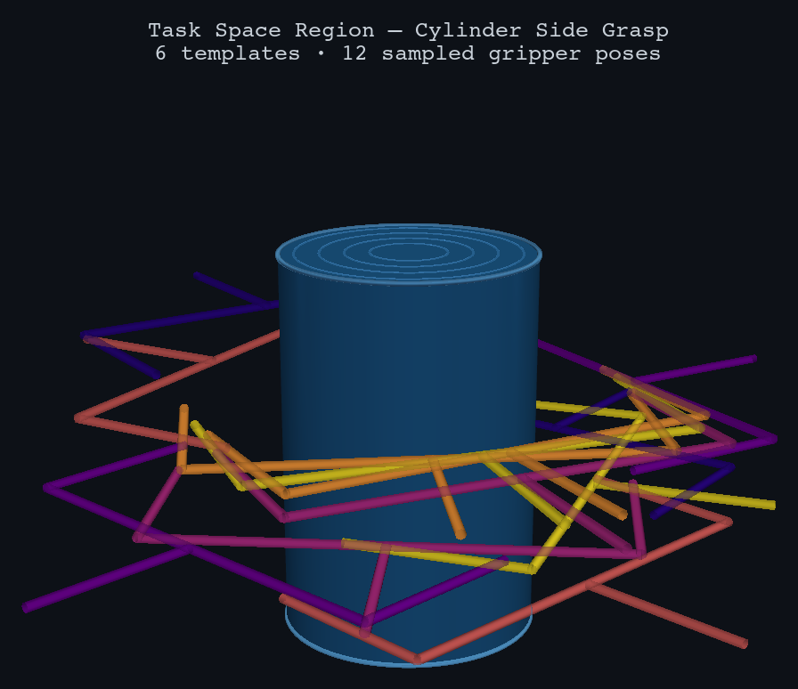

# Task Space Regions (TSR)

A Python library for pose-constrained manipulation planning using Task Space Regions.

Based on the IJRR paper ["Task Space Regions: A Framework for Pose-Constrained Manipulation Planning"](https://www.ri.cmu.edu/pub_files/2011/10/dmitry_ijrr10-1.pdf) by Berenson, Srinivasa, and Kuffner.



## Installation

```bash
uv add git+https://github.com/personalrobotics/tsr.git
```

For visualization support:
```bash
uv add "tsr[viz] @ git+https://github.com/personalrobotics/tsr.git"
```

For development:
```bash
git clone https://github.com/personalrobotics/tsr.git
cd tsr
uv sync --extra test
```

## Quick Start

### Generate grasp templates from object geometry

```python
from tsr.template import TSRTemplate
import numpy as np

# Define your gripper (finger_length and max_aperture are all you need)
from examples.parallel_jaw_grasp import ParallelJawGripper

gripper = ParallelJawGripper(finger_length=0.055, max_aperture=0.140)

# Generate side-grasp templates for a cylinder
# Returns 6 TSRTemplates: 3 depth levels × 2 roll orientations
templates = gripper.grasp_cylinder(
    object_radius=0.040,        # 4cm radius
    height_range=(0.02, 0.10),  # graspable height band
    reference="mug",            # label for the reference object
)

for t in templates:
    print(t.name)
    # "Mug Cylinder Side Grasp — shallow, roll 0°"
    # "Mug Cylinder Side Grasp — shallow, roll 180°"
    # ...

# Instantiate at a specific object pose and sample
mug_pose = np.eye(4)
mug_pose[:3, 3] = [0.5, 0.0, 0.0]  # mug at x=0.5

grasp_poses = [t.instantiate(mug_pose).sample() for t in templates]
```

### Work directly with TSRs

```python
from tsr import TSR, TSRTemplate, TSRChain
import numpy as np

# A TSR is defined by three components:
#   T0_w : 4×4 transform — world frame to TSR frame
#   Tw_e : 4×4 transform — TSR frame to end-effector at Bw=0
#   Bw   : 6×2 bounds — [x, y, z, roll, pitch, yaw]

T0_w = np.eye(4)
Tw_e = np.eye(4)
Bw   = np.zeros((6, 2))
Bw[2, :] = [0.0,  0.10]       # z: 0–10 cm
Bw[5, :] = [-np.pi, np.pi]    # yaw: full rotation

tsr = TSR(T0_w=T0_w, Tw_e=Tw_e, Bw=Bw)

pose     = tsr.sample()                      # random SE(3) pose in the region
distance, _ = tsr.distance(pose)            # distance to nearest valid pose
is_valid = tsr.contains(pose)               # containment check
```

### Save and load templates

```python
from tsr import TSRTemplate, save_template, load_template

template = TSRTemplate(
    T_ref_tsr=np.eye(4),
    Tw_e=Tw_e,
    Bw=Bw,
    task="grasp",
    subject="gripper",
    reference="mug",
    name="Mug Side Grasp",
    description="Side grasp on a cylindrical mug body",
)

save_template(template, "my_grasp.yaml")
template = load_template("my_grasp.yaml")

# Bind to an object pose at runtime
tsr = template.instantiate(mug_pose)
```

## Gripper frame convention

All TSR templates in this library use a canonical gripper frame:

```
z = approach direction  (toward object surface)
y = finger opening direction
x = palm normal         (right-hand rule: x = y × z)
```

AnyGrasp / GraspNet uses `x = approach` — convert with:
```python
R_convert = np.array([[0, 0, -1], [0, 1, 0], [1, 0, 0]])
```

## TSR Chains

For coupled constraints (e.g., door opening, constrained transport):

```python
from tsr import TSRChain

chain = TSRChain(TSRs=[hinge_tsr, handle_tsr])
pose  = chain.sample()
```

## Visualization

```python
from tsr.viz import TSRVisualizer, cylinder_renderer, parallel_jaw_renderer, plasma_colors

poses  = [t.instantiate(mug_pose).sample() for t in templates]
colors = plasma_colors(len(templates))

TSRVisualizer(
    title="Cylinder Side Grasp",
    focus=(0., 0., 0.06),
).render(
    reference_renderer=cylinder_renderer(radius=0.04, height=0.12),
    subject_renderer=parallel_jaw_renderer(finger_length=0.055, half_aperture=0.07),
    poses=poses,
    colors=colors,
    out="grasp_viz.png",
)
```

Requires the `viz` extra: `uv sync --extra viz`.

## Documentation

- **[Tutorial](docs/tutorial.md)** — TSR theory, math, and worked examples
- **[Examples](examples/)** — Runnable scripts (`uv run python examples/<script>.py`)

## Testing

```bash
uv run pytest tests/ -v
```

## License

BSD-2-Clause — see LICENSE file.
