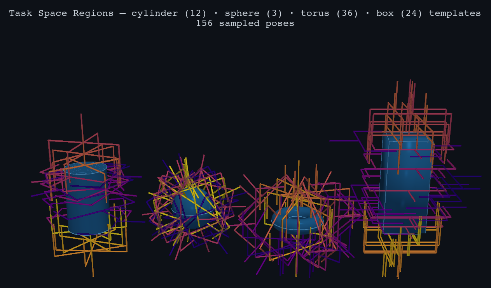
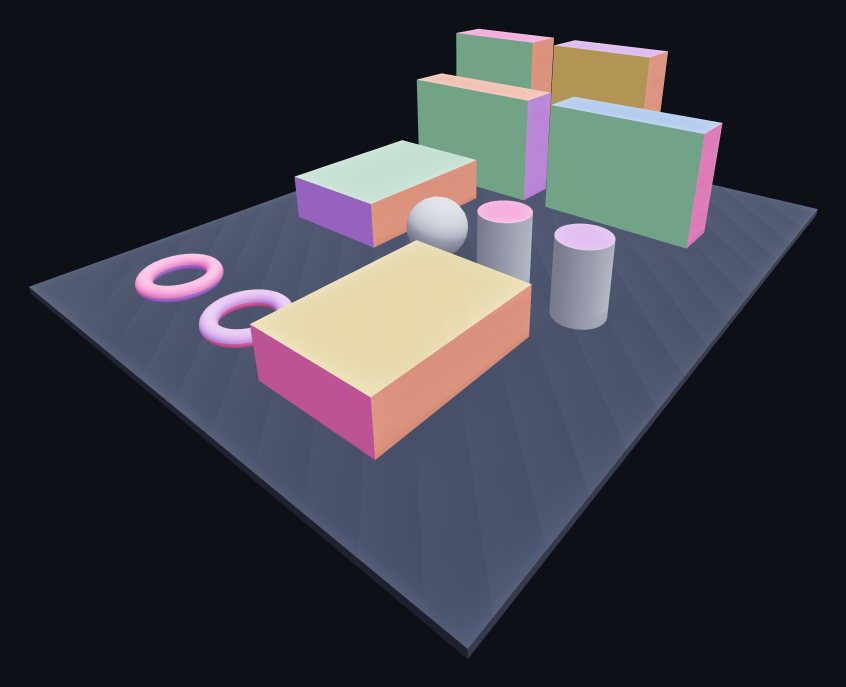
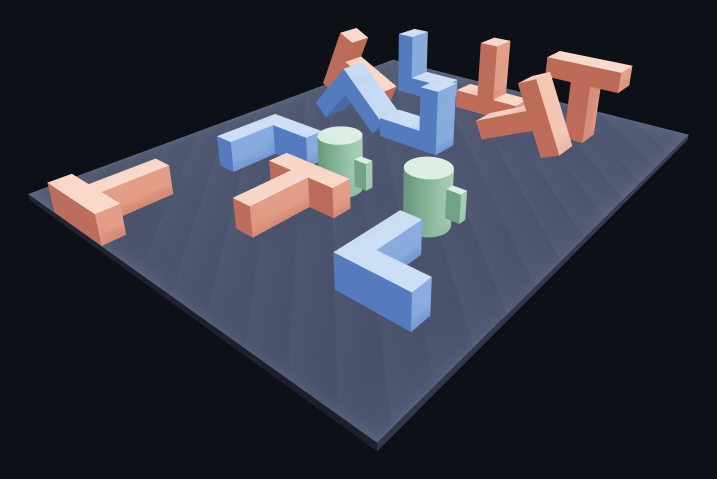

# Task Space Regions (TSR)

A Python library for pose-constrained manipulation planning using Task Space Regions.

TSRs encode *any* manipulation constraint as a bounded region in SE(3): grasping,
placing, transporting, pouring, tool use, and more. A planner samples from a TSR
to get valid end-effector poses satisfying the constraint.

Based on the IJRR paper ["Task Space Regions: A Framework for Pose-Constrained Manipulation Planning"](https://www.ri.cmu.edu/pub_files/2011/10/dmitry_ijrr10-1.pdf) by Berenson, Srinivasa, and Kuffner.

## Gallery

### Grasps



### Stable placements



*Cylinder, box, sphere, and torus in every stable pose on a table surface.*



*L-shape, T-shape, and a mug (cylinder + handle) — `place_mesh` applied to arbitrary vertex clouds. Each object is shown in all stable orientations above the 5° margin threshold.*

## Installation

The distribution is named **`sstsr`** on PyPI; the import name is `tsr`.

```bash
pip install sstsr      # or: uv add sstsr
```
```python
import tsr             # the import name is unchanged
```

For visualization support:
```bash
pip install "sstsr[viz]"     # interactive viewer (Viser); "sstsr[viser]" is the same
```

For development:
```bash
git clone https://github.com/personalrobotics/sstsr.git
cd tsr
uv sync --extra test
```

## Quick Start

### Load templates for a full manipulation task

Templates are YAML files that encode pose constraints for each step of a task.
The library ships with two narratives:

```python
from tsr import load_package_template
import numpy as np

# --- Tool use: screwdriver ---
grasp = load_package_template("grasps", "screwdriver_grasp.yaml")
drive = load_package_template("tasks",  "drive_screw.yaml")
drop  = load_package_template("places", "toolchest_drop.yaml")

screwdriver_pose = np.eye(4)
screwdriver_pose[:3, 3] = [0.4, 0.1, 0.02]

gripper_poses = grasp.sample(screwdriver_pose)

# --- Everyday manipulation: mug of water ---
pick      = load_package_template("grasps", "mug_handle_grasp.yaml")
carry     = load_package_template("tasks",  "mug_transport_upright.yaml")
pour      = load_package_template("tasks",  "mug_pour_into_sink.yaml")
place     = load_package_template("places", "mug_on_table.yaml")
```

These packaged YAML files are illustrative, hand-authored pose-constraint recipes.
They are tested for representation validity, but they do not carry the geometric
soundness guarantee of templates produced by the primitive grasp factories below.
Users remain responsible for checking them against the intended object and gripper.

### Generate templates from object geometry

#### Grasping

`ParallelJawGripper` generates TSR templates directly from shape parameters.
Pre-configured subclasses are provided for common grippers:

Values match the class constants. `finger_length` is the graspable depth along
the approach axis, from the TSR "palm" to the pad-contact point; the reference
point for that measurement is listed explicitly (they are not interchangeable).

| Class | `finger_length` | `max_aperture` | `finger_length` reference (palm → pad tip) |
|---|---|---|---|
| `Robotiq2F140` | 114 mm | 128 mm | palm (`grasp_site`, base_mount + 100 mm) → pad tip |
| `Robotiq2F85` | 59 mm | 85 mm | palm (housing forward edge) → pad tip |
| `FrankaHand` | 37 mm | 80 mm | palm (hand-body forward edge) → pad tip |

```python
import numpy as np
from tsr.hands import ParallelJawGripper, Robotiq2F85, Robotiq2F140, FrankaHand

# Use a pre-configured gripper for a known hardware platform
gripper = Robotiq2F140()
gripper = FrankaHand()

# Or configure manually for custom hardware (generic 55 mm-fingered gripper)
gripper = ParallelJawGripper(finger_length=0.055, max_aperture=0.140)

# Cylinder — side + top + bottom: 4*k templates (default k=3: 12 total)
templates = gripper.grasp_cylinder(
    cylinder_radius=0.040,   # 4 cm radius
    cylinder_height=0.120,   # 12 cm tall
    reference="mug",
)

# Box — all six faces, two finger orientations per face: up to 2*6*k templates
templates = gripper.grasp_box(box_x=0.08, box_y=0.06, box_z=0.18, reference="box")

# Sphere — full SO(3) approach: k templates
templates = gripper.grasp_sphere(object_radius=0.040, reference="ball")

# Torus — side (all minor angles) + span (if aperture allows)
templates = gripper.grasp_torus(
    torus_radius=0.035,   # major radius R: center to tube center
    tube_radius=0.015,    # minor radius r: tube cross-section
    reference="handle",
)

# Instantiate at a specific object pose and sample
mug_pose = np.eye(4)
mug_pose[:3, 3] = [0.5, 0.0, 0.0]   # mug at x=0.5m

grasp_poses = [t.sample(mug_pose) for t in templates]
```

#### Placing

`StablePlacer` generates one TSR template per stable resting pose on a flat surface:

```python
import numpy as np
from tsr.placement import StablePlacer

placer = StablePlacer(table_x=0.60, table_y=0.40)

# Analytic primitives
templates = placer.place_cylinder(cylinder_radius=0.040, cylinder_height=0.120, subject="mug")
templates = placer.place_box(lx=0.08, ly=0.06, lz=0.18, subject="box")   # one per face: 6
templates = placer.place_sphere(radius=0.040, subject="ball")
templates = placer.place_torus(major_radius=0.035, minor_radius=0.015, subject="ring")

# Arbitrary mesh — pass any (N, 3) vertex cloud + centre of mass
vertices = np.array([...])   # (N, 3) points
com      = np.array([cx, cy, cz])
templates = placer.place_mesh(vertices, com, subject="widget",
                              min_margin_deg=5.0)  # discard marginal poses

# Each template encodes one stable orientation; sample a table pose for it
table_pose = np.eye(4)
table_pose[2, 3] = 0.75   # table surface at z = 0.75 m

for t in templates:
    pose = t.sample(table_pose)
    print(t, "→ origin z =", pose[2, 3])
```

Stability is determined by the COM-projection criterion: a face is stable if the
centre of mass projects strictly inside the support polygon formed by that face's
contact region. Every template reports a `stability_margin` — the physical tipping
angle `arctan(d_min / h_com)`, where `d_min` is the in-plane distance from the COM
projection to the nearest edge of the polygon — and every factory takes
`min_margin_deg` to discard poses below a threshold. A sphere reports `0`: it is
neutrally stable, so it rolls rather than tipping.

Every template also carries a machine-readable `provenance` — the resting face's normal,
the `support_margin` and `com_height` the angle is built from, the `footprint_radius`
behind the sliding bounds — so you read the semantics structurally instead of parsing
`name`:

```python
p = templates[0].provenance
p.face_normal        # (0.0, 0.0, -1.0) in the object frame
p.equilibrium        # 'stable', or 'neutral' for a sphere that rolls
p.footprint_radius   # the inset applied to Bw's xy bounds
```

### Work directly with TSRs

```python
from tsr import TSR, sample_haar
import numpy as np

# A TSR is defined by three components:
#   T0_w : 4×4 transform — world frame to TSR frame
#   Tw_e : 4×4 transform — TSR frame to end-effector at Bw=0
#   Bw   : 6×2 bounds — [x, y, z, roll, pitch, yaw]

# Example: keep a mug upright — free xy/yaw, small pitch/roll
T0_w = np.eye(4)
Tw_e = np.eye(4)
Bw   = np.zeros((6, 2))
Bw[0, :] = [-2.0,  2.0]       # x: anywhere in workspace
Bw[1, :] = [-2.0,  2.0]       # y: anywhere in workspace
Bw[2, :] = [ 0.5,  1.5]       # z: transport height
Bw[3, :] = [-0.26, 0.26]      # roll:  ±15°
Bw[4, :] = [-0.26, 0.26]      # pitch: ±15°
Bw[5, :] = [-np.pi, np.pi]    # yaw: free

tsr = TSR(T0_w=T0_w, Tw_e=Tw_e, Bw=Bw)

pose     = tsr.sample()             # random SE(3) pose in the region
distance, _ = tsr.distance(pose)   # distance to nearest valid pose
is_valid = tsr.contains(pose)      # containment check

# Haar-uniform rotations over the same region, reproducible under an explicit RNG
rng  = np.random.default_rng(42)
pose = sample_haar(tsr, rng)
```

`tsr.sample()` draws roll, pitch, and yaw uniformly, which covers the region but is
not uniform over rotations. `sample_haar` samples rotations Haar-uniformly over the
same region (for example, approach directions uniform over a sphere grasp).

### Save and load templates

```python
from tsr import TSRTemplate, save_template, load_template
import numpy as np

template = TSRTemplate(
    T_ref_tsr=np.eye(4),
    Tw_e=Tw_e,
    Bw=Bw,
    task="transport",
    subject="mug",
    reference="world",
    name="Mug Transport Upright",
    description="Keep mug upright during transport, ±15° tilt tolerance",
)

save_template(template, "my_template.yaml")
template = load_template("my_template.yaml")

# Bind to an object pose at runtime
tsr = template.instantiate(np.eye(4))
```

## End-effector frame convention

All templates in this library use a canonical end-effector frame:

```
z = approach direction  (toward contact surface)
y = opening / spread direction  (finger opening for grippers, tool axis for others)
x = right-hand normal   (x = y × z)
```

AnyGrasp / GraspNet uses `x = approach` — convert with:
```python
R_convert = np.array([[0, 0, -1], [0, 1, 0], [1, 0, 0]])
```

## TSR Chains

For coupled multi-body constraints (e.g., door opening, bimanual transport). A chain composes
its links serially: the first is placed by its own `T0_w`, and every later one is placed *by
the chain*, on the previous link's end frame. A later link's `T0_w` is therefore never read,
and `append` refuses a non-identity one rather than silently dropping the offset — put it in
the **previous** link's `Tw_e`, which is what moves the end frame the next link hangs off.

```python
from tsr import TSRChain

chain = TSRChain(TSRs=[hinge_tsr, handle_tsr])
pose  = chain.sample()
```

Membership is where a chain differs from a single TSR. A TSR has a closed-form `contains`; a
chain has to invert a composition, which is a bounded non-convex problem. So sampling hands
back the coordinates that built the pose, and those are a **constructive witness**:

```python
s = chain.sample_with_witness()
chain.validate_witness(s.pose, s.coordinates)   # exact: one bounds check, one composition
chain.contains(s.pose, initial_guess=s.coordinates)   # the same fast path
```

Without a witness, `contains` runs a bounded numerical solve. `True` means one was found;
`False` means none was found **within the budget**, and is not a proof of non-membership —
`distance` is likewise an upper bound rather than a certified distance. Keep the witness when
you have one.

## Visualization

The recommended viewer is interactive and browser-based:

```bash
pip install "sstsr[viser]"        # or: uv sync --extra viser
uv run python examples/viser_cylinder_grasps.py --explore
```

```python
from tsr.hands import ParallelJawGripper
from tsr.viser import explore_templates, show_templates

gripper   = ParallelJawGripper(finger_length=0.08, max_aperture=0.14)
templates = gripper.grasp_cylinder_side(0.03, 0.12)

server = show_templates(templates, cylinder=(0.03, 0.12), gripper=gripper, seed=0)
server = explore_templates(templates, cylinder=(0.03, 0.12), gripper=gripper)
```

For debugging generation itself — change a primitive's dimensions, the gripper, `k` or
the clearance and watch the TSRs change, with the reason shown when a request yields
nothing — use the studio:

```python
from tsr.viser import studio
studio().sleep_forever()
```

Open <http://localhost:8080>. `show_templates` draws a reproducibly sampled cloud;
`explore_templates` gives a slider per free `Bw` coordinate so one grasp can be scrubbed
through the region. Over SSH, forward the port: `ssh -L 8080:localhost:8080 user@host`.
Details in [docs/VISER.md](docs/VISER.md).

## From C++

A planner that evaluates a TSR on every edge sample should not pay a Python call to do it.
`cpp/` is a second implementation of the region **and** the chain — standard library only,
C++20, no linear-algebra dependency to hold a pose — and the wheel carries its sources,
headers and CMake package, so `pip install sstsr` is all a C++ consumer needs.

Ask the installed package where the CMake package is:

```cmake
find_package(Python COMPONENTS Interpreter)
execute_process(
  COMMAND "${Python_EXECUTABLE}" -c "import tsr; print(tsr.get_cmake_dir(), end='')"
  OUTPUT_VARIABLE TSR_CMAKE_DIR RESULT_VARIABLE rc ERROR_QUIET)
if(rc EQUAL 0 AND TSR_CMAKE_DIR)
  list(APPEND CMAKE_PREFIX_PATH "${TSR_CMAKE_DIR}")
endif()
find_package(sstsr_cpp CONFIG REQUIRED)
target_link_libraries(my_planner PRIVATE sstsr::sstsr_cpp)
```

```cpp
#include "sstsr/tsr_chain.hpp"

// A door handle on a hinge: the first link turns, the second grasps the bar.
const sstsr::TSRChain chain({hinge, handle});

sstsr::Rng rng(7);
const sstsr::ChainSample s = chain.sample_with_witness(rng);

// Sampling hands back the coordinates that built the pose, so membership is one bounds
// check and one composition -- no optimiser at all.
assert(chain.validate_witness(s.pose, s.coordinates));

// And the inverse, for a pose you were handed instead of one you sampled.
const auto [residual, closest] = chain.closest_transform(pose);
```

`get_cmake_dir()` raises from an editable install, because only a built wheel carries a
relocatable CMake package; point CMake at `cpp/` directly in that case, as
`cpp/examples/consumer` does.

**The Python is the source of truth for the rules.** The C++ is held to them by a checked-in
corpus of the Python's own answers, and neither implementation reads the other. Two things
are deliberately not shared: the sampling engine, so a seeded sample is reproducible *within*
an implementation rather than across the two; and a chain's **cold** inverse, which reports
the best point a bounded search found and so is specified by properties rather than by
recorded numbers. [docs/CPP.md](docs/CPP.md) has the whole contract.

## Documentation
- **[Tutorial](docs/tutorial.md)** — TSR theory, math, and worked examples
- **[Architecture](docs/ARCHITECTURE.md)** — the four layers, and the geometric contract every factory is held to
- **[The C++ core](docs/CPP.md)** — using `sstsr_cpp`, and what the two implementations do and do not agree on
- **[Interactive viewer](docs/VISER.md)** — inspecting templates with Viser
- **[Releasing](docs/RELEASING.md)** — the tag-driven release pipeline
- **[Examples](examples/)** — Runnable scripts (`uv run python examples/<script>.py`)

## Testing

```bash
uv run pytest tests/ -v
```

## License

BSD-2-Clause — see LICENSE file.
