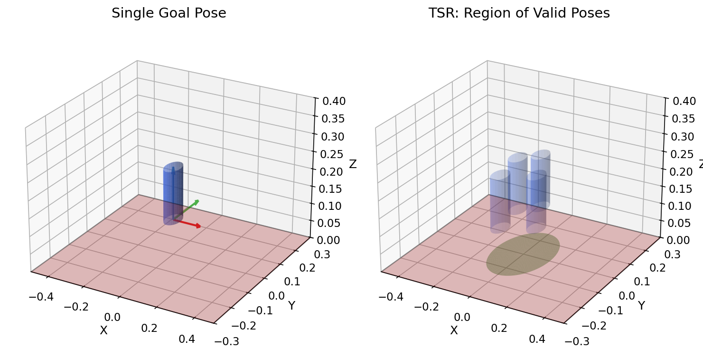
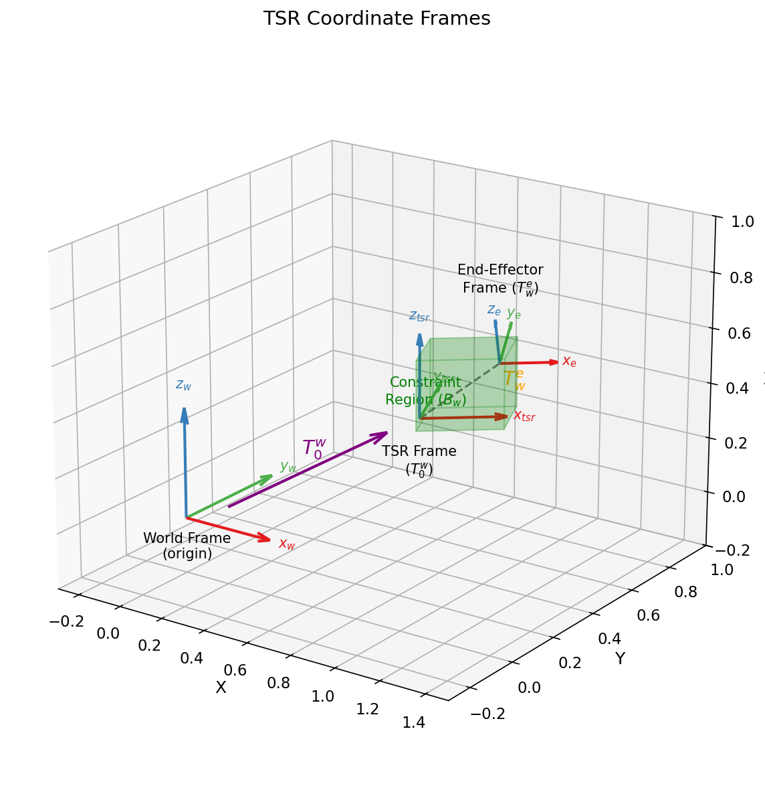
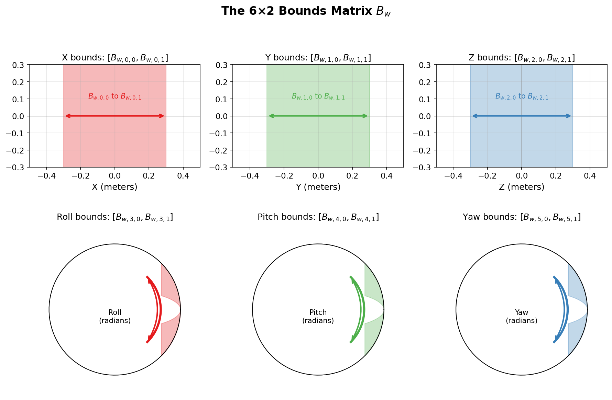
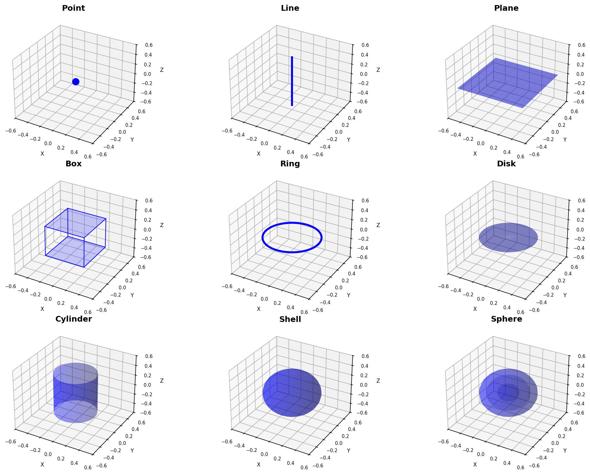
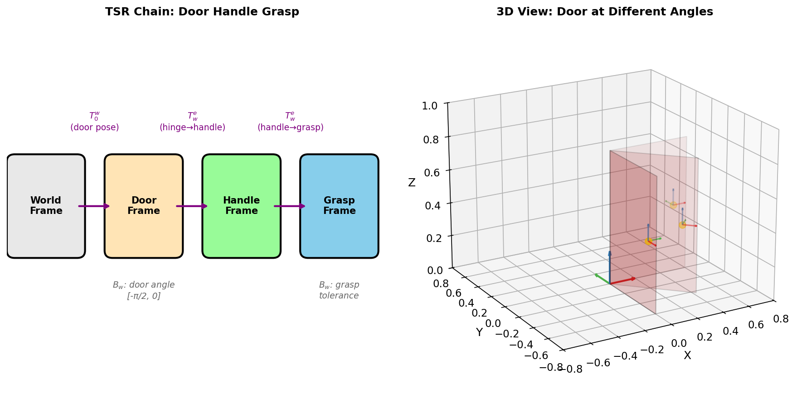
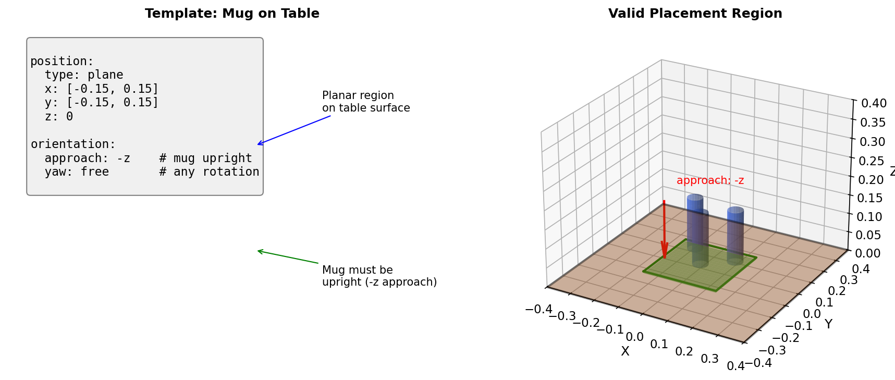

# Task Space Regions (TSR) Tutorial

A comprehensive guide to understanding and using Task Space Regions for robotic manipulation.

## Table of Contents

1. [Introduction](#introduction)
2. [What is a TSR?](#what-is-a-tsr)
3. [Mathematical Formulation](#mathematical-formulation)
4. [The Bounds Matrix](#the-bounds-matrix)
5. [Geometric Primitives](#geometric-primitives)
6. [TSR Chains](#tsr-chains)
7. [Using Templates](#using-templates)
8. [Reference Frames](#reference-frames)
9. [Practical Examples](#practical-examples)

---

## Introduction

When programming robots to manipulate objects, we often need to specify **where** and **how** an object should be placed or grasped. The naive approach—specifying a single exact pose—is brittle:

- Manufacturing tolerances mean objects are never exactly where we expect
- A mug can be placed anywhere on a table, not just one specific spot
- A drawer handle can be grasped at any point along its length

**Task Space Regions (TSRs)** solve this by specifying a *region* of valid poses rather than a single pose.



*Left: A single goal pose is fragile. Right: A TSR defines a region of valid poses (green), any of which satisfies the task.*

---

## What is a TSR?

A **Task Space Region** defines a continuous set of valid end-effector poses relative to some reference frame. Instead of saying "place the mug at exactly (x=0.5, y=0.3, z=0.1)", a TSR says "place the mug anywhere on this table surface, in an upright orientation."

TSRs are useful for:

- **Placement tasks**: Defining where objects can be placed (on tables, shelves, in containers)
- **Grasp specification**: Defining valid grasp poses for objects
- **Motion constraints**: Keeping the end-effector in a valid region during manipulation
- **Articulated objects**: Describing constraints that move with doors, drawers, etc.

---

## Mathematical Formulation

A TSR is defined by three components:

### 1. World-to-TSR Transform: $T_0^w$

This 4×4 homogeneous transformation matrix positions the TSR frame in the world. It represents where the constraint region is located.

$$T_0^w = \begin{bmatrix} R_{3\times3} & t_{3\times1} \\ 0_{1\times3} & 1 \end{bmatrix}$$

**Example**: For placing a mug on a table, $T_0^w$ would be the pose of the table surface.

### 2. TSR-to-End-Effector Transform: $T_w^e$

This 4×4 matrix defines the nominal (center) pose of the end-effector relative to the TSR frame.

**Example**: For a mug placement, this might be the identity matrix (end-effector frame coincides with TSR frame when centered).

### 3. Bounds Matrix: $B_w$

A 6×2 matrix defining the allowed deviations from the nominal pose:

$$B_w = \begin{bmatrix}
x_{min} & x_{max} \\
y_{min} & y_{max} \\
z_{min} & z_{max} \\
roll_{min} & roll_{max} \\
pitch_{min} & pitch_{max} \\
yaw_{min} & yaw_{max}
\end{bmatrix}$$



*The three coordinate frames in a TSR: World frame (origin), TSR frame (positioned by $T_0^w$), and end-effector frame (offset by $T_w^e$ plus bounded variation).*

### Sampling from a TSR

To sample a valid pose from a TSR:

1. Sample a displacement vector $\Delta = (\Delta x, \Delta y, \Delta z, \Delta roll, \Delta pitch, \Delta yaw)$ where each component is uniformly sampled from its bounds in $B_w$
2. Convert $\Delta$ to a transformation matrix $T_\Delta$
3. Compute the end-effector pose: $T_{ee} = T_0^w \cdot T_\Delta \cdot T_w^e$

### Checking if a Pose is Valid

To check if an end-effector pose $T_{ee}$ satisfies a TSR:

1. Compute the relative transform: $T_{rel} = (T_0^w)^{-1} \cdot T_{ee} \cdot (T_w^e)^{-1}$
2. Extract the displacement: $\Delta = (x, y, z, roll, pitch, yaw)$ from $T_{rel}$
3. Check if each component is within its bounds in $B_w$

---

## The Bounds Matrix

The 6×2 bounds matrix $B_w$ is the heart of a TSR. Each row constrains one degree of freedom:



| Row | DOF | Units | Description |
|-----|-----|-------|-------------|
| 0 | X | meters | Translation along local X axis |
| 1 | Y | meters | Translation along local Y axis |
| 2 | Z | meters | Translation along local Z axis |
| 3 | Roll | radians | Rotation about local X axis |
| 4 | Pitch | radians | Rotation about local Y axis |
| 5 | Yaw | radians | Rotation about local Z axis |

> **Units Convention:** The raw Bw matrix uses **radians** for rotations. YAML templates use **degrees** for human readability—conversion happens automatically when loading templates.

### Special Values

- **Fixed constraint**: Set min = max (e.g., `z: [0, 0]` means z must be exactly 0)
- **Free rotation**: Set to `[-π, π]` for full rotation freedom
- **Unbounded**: While mathematically possible, practical TSRs use finite bounds

### Example: Mug on Table

```python
Bw = np.array([
    [-0.15, 0.15],   # x: 30cm range on table
    [-0.15, 0.15],   # y: 30cm range on table
    [0.0, 0.0],      # z: exactly on surface
    [0.0, 0.0],      # roll: no tilt
    [0.0, 0.0],      # pitch: no tilt
    [-np.pi, np.pi]  # yaw: any rotation
])
```

---

## Geometric Primitives

Rather than manually constructing bounds matrices, this library provides **9 geometric primitives** that map to common constraint shapes:



### Position Primitives

| Primitive | Description | Parameters |
|-----------|-------------|------------|
| **point** | Single point | `x`, `y`, `z` |
| **line** | Line segment | `axis`, `range` |
| **plane** | Flat rectangular region | `x`, `y`, `z` (one fixed) |
| **box** | 3D rectangular volume | `x`, `y`, `z` ranges |
| **ring** | Circle (perimeter only) | `axis`, `radius`, `height` |
| **disk** | Filled circle | `axis`, `radius`, `height`, `angle` |
| **cylinder** | Cylindrical volume | `axis`, `radius`, `height` |
| **shell** | Spherical surface | `radius` (constant) |
| **sphere** | Solid sphere | `radius` range |

### Orientation Primitives

In YAML templates, orientation is specified using:
- **approach**: Direction the end-effector's Z-axis points (`+x`, `-z`, etc.)
- **roll**, **pitch**, **yaw**: Allowed rotation ranges in **degrees**
- **free**: Shorthand for full rotation freedom ([-180, 180])

### Primitive to Bounds Mapping

Each primitive is converted to bounds internally. **YAML templates use degrees, but the underlying Bw matrix uses radians.** The conversion happens automatically when loading templates.

**Disk** with `axis=z`, `radius=[0, 0.1]`, `height=0`, `angle=[0, 360]`:
```python
# YAML uses degrees:        angle=[0, 360]
# Converted to Bw radians:  yaw=[0, 2π]
Bw = [
    [0, 0.1],        # radius maps to x
    [0, 0],          # y = 0 (cylindrical coords)
    [0, 0],          # z = height
    [0, 0],          # roll
    [0, 0],          # pitch
    [0, 2π]          # yaw maps to angle (radians)
]
```

---

## TSR Chains

A **TSR Chain** connects multiple TSRs in sequence, where each TSR's frame is relative to the previous one. This is essential for **articulated objects** like doors, drawers, and multi-link mechanisms.



### Example: Door Handle Grasp

Consider grasping a door handle. The handle's position depends on the door's angle:

```
World → Door Frame → Handle Frame → Grasp Frame
         (hinge)      (on door)     (on handle)
```

```python
from tsr import TSR, TSRChain

# TSR 1: Door rotation about hinge
door_tsr = TSR(
    T0_w=door_hinge_pose,    # Hinge location in world
    Tw_e=np.eye(4),          # No offset
    Bw=np.array([
        [0, 0], [0, 0], [0, 0],           # No translation
        [0, 0], [0, 0], [-np.pi/2, 0]     # Door angle: closed to 90° open
    ])
)

# TSR 2: Handle position on door (fixed relative to door)
handle_tsr = TSR(
    T0_w=np.eye(4),          # Relative to previous frame
    Tw_e=handle_offset,      # Handle location on door
    Bw=np.zeros((6, 2))      # Fixed position
)

# TSR 3: Grasp tolerance on handle
grasp_tsr = TSR(
    T0_w=np.eye(4),
    Tw_e=np.eye(4),
    Bw=np.array([
        [-0.02, 0.02], [0, 0], [0, 0],    # Small position tolerance
        [0, 0], [0, 0], [-np.pi, np.pi]   # Any grasp rotation
    ])
)

chain = TSRChain(TSRs=[door_tsr, handle_tsr, grasp_tsr])
```

### How Chains Work

When sampling or evaluating a chain:
1. Sample/check the first TSR to get $T_1$
2. Use $T_1$ as the world frame for TSR 2, sample to get $T_2$
3. Continue until the final transform $T_n$ is computed

The result is a grasp pose that's valid for any door angle within the allowed range.

---

## Using Templates

Templates provide a human-friendly YAML format for specifying TSRs:

```yaml
# templates/places/mug_on_table.yaml
name: Mug on Table
description: Place mug upright on table surface
task: place
subject: mug
reference: table
reference_frame: bottom

position:
  type: plane
  x: [-0.15, 0.15]
  y: [-0.15, 0.15]
  z: 0

orientation:
  approach: -z
  yaw: free
```

### Loading Templates

```python
from tsr import load_template_file

template = load_template_file('templates/places/mug_on_table.yaml')

print(template.name)        # "Mug on Table"
print(template.Bw)          # 6x2 bounds matrix
print(template.reference_frame)  # "bottom"
```

### Creating TSRs from Templates

```python
from tsr import TSR
import numpy as np

# Get table pose from perception
table_pose = get_table_pose()

# Create TSR from template
tsr = TSR(
    T0_w=table_pose,
    Tw_e=template.Tw_e,
    Bw=template.Bw
)
```

---

## Reference Frames

When placing objects, the constraint is typically defined relative to a **specific part** of the object, not its center of mass.



### The Reference Frame Field

The `reference_frame` field in templates specifies which part of the subject object the template expects:

| Value | Meaning |
|-------|---------|
| `None` | Object's canonical origin (usually center) |
| `bottom` | Bottom surface of the object |
| `top` | Top surface |
| `handle` | Handle attachment point |
| `side` | Side surface (for horizontal placement) |

### Example: Mug Placement

When placing a mug on a table:
- The table surface defines the TSR frame
- The constraint should apply to the **bottom of the mug**, not its center
- Template specifies `reference_frame: bottom`

```python
template = load_template_file('mug_on_table.yaml')
print(template.reference_frame)  # "bottom"

# Your code must transform from mug origin to mug bottom
mug_bottom_pose = mug_origin_pose @ mug_bottom_offset
```

The library doesn't prescribe how you store object frame information—this is application-specific. The `reference_frame` field documents what the template expects.

---

## Practical Examples

### Example 1: Grasp a Cylindrical Object

```python
from tsr import TSR
import numpy as np

# Object pose from perception
object_pose = np.array([
    [1, 0, 0, 0.5],
    [0, 1, 0, 0.3],
    [0, 0, 1, 0.1],
    [0, 0, 0, 1]
])

# Grasp TSR: approach from side, any angle around cylinder
grasp_tsr = TSR(
    T0_w=object_pose,
    Tw_e=np.eye(4),
    Bw=np.array([
        [0, 0],              # x: centered
        [0, 0],              # y: centered
        [-0.05, 0.05],       # z: along cylinder height
        [0, 0],              # roll: fixed
        [0, 0],              # pitch: fixed
        [-np.pi, np.pi]      # yaw: any angle around cylinder
    ])
)

# Sample valid grasp poses
for _ in range(10):
    pose = grasp_tsr.sample()
    print(pose[:3, 3])  # Print position
```

### Example 2: Place Book on Shelf

```python
from tsr import load_template_file, TSR

# Load template
template = load_template_file('templates/places/book_on_shelf.yaml')

# Shelf pose from perception
shelf_pose = get_shelf_pose()

# Create placement TSR
place_tsr = TSR(
    T0_w=shelf_pose,
    Tw_e=template.Tw_e,
    Bw=template.Bw
)

# Check if a proposed placement is valid
proposed_pose = plan_placement()
distance = place_tsr.distance(proposed_pose)

if distance == 0:
    print("Valid placement!")
else:
    print(f"Invalid - distance from valid region: {distance}")
```

### Example 3: Pour from Bottle (Trajectory Constraint)

```python
from tsr import TSR, TSRChain

# Glass position
glass_pose = get_glass_pose()

# Pouring constraint: bottle tip over glass, tilted
pour_tsr = TSR(
    T0_w=glass_pose,
    Tw_e=np.eye(4),
    Bw=np.array([
        [-0.02, 0.02],       # Small x tolerance
        [-0.02, 0.02],       # Small y tolerance
        [0.15, 0.20],        # Above glass
        [-np.pi/4, -np.pi/6], # Tilted for pouring
        [0, 0],
        [-np.pi, np.pi]      # Any angle around glass
    ])
)

# This TSR can constrain the motion planner to keep
# the bottle in a valid pouring pose throughout the trajectory
```

---

## Summary

Task Space Regions provide a powerful abstraction for specifying manipulation constraints:

| Concept | Purpose |
|---------|---------|
| **$T_0^w$** | Positions the constraint in the world |
| **$T_w^e$** | Nominal end-effector offset |
| **$B_w$** | Allowed deviations (the actual constraint) |
| **Primitives** | Human-friendly geometric shapes |
| **TSR Chains** | Articulated object constraints |
| **Templates** | Reusable YAML constraint definitions |
| **reference_frame** | Which object frame the constraint applies to |

For more details, see the [API documentation](API.md) and [examples](../examples/).

---

## References

1. Berenson, D., Srinivasa, S., Ferguson, D., & Kuffner, J. (2009). *Manipulation planning on constraint manifolds*. IEEE International Conference on Robotics and Automation.

2. Berenson, D., Srinivasa, S., & Kuffner, J. (2011). *Task Space Regions: A framework for pose-constrained manipulation planning*. International Journal of Robotics Research.
